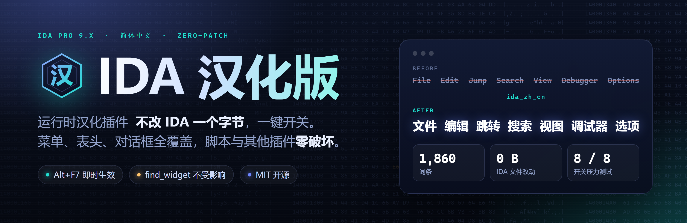
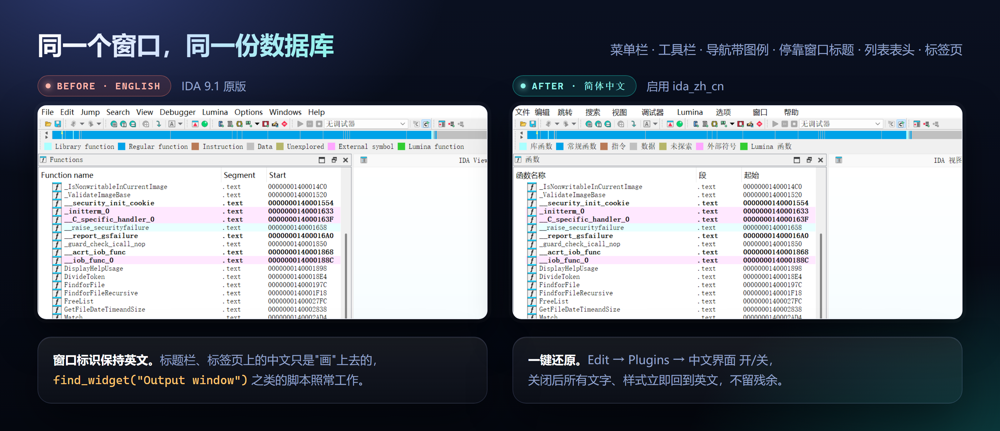
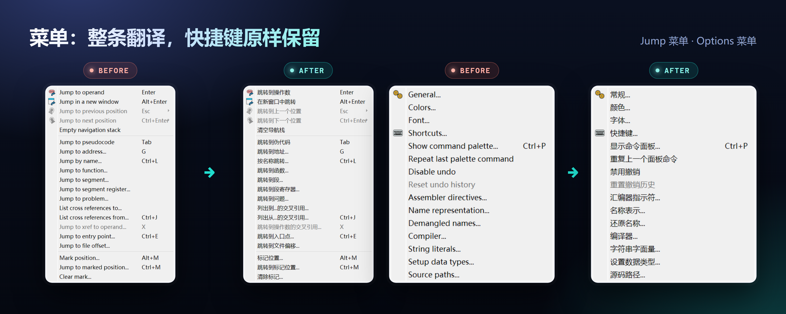
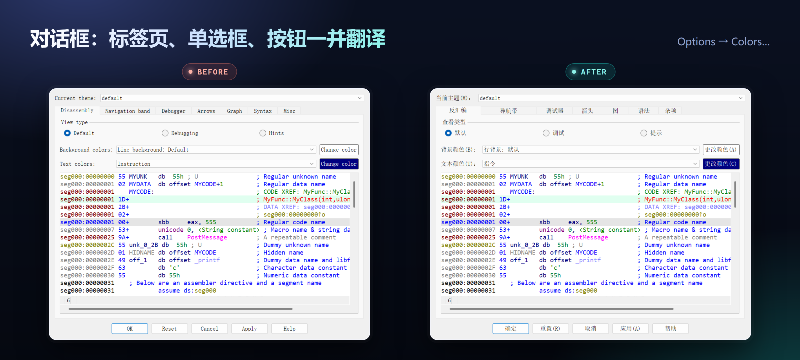
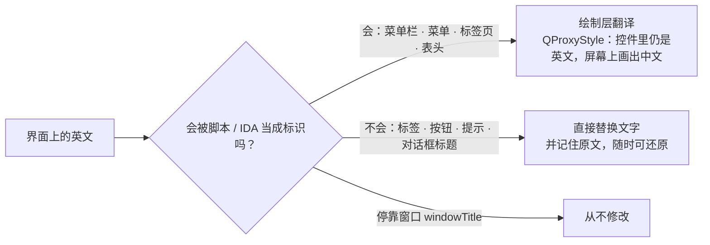

<div align="center">



<br>

[](https://github.com/3641397194-wq/ida-zh-cn/actions/workflows/ci.yml)
[](LICENSE)
[](#兼容性与测试)
[](#兼容性与测试)
[](#兼容性与测试)

**运行时汉化插件 · 不改 IDA 一个字节 · 一键开关 · 脚本与其他插件零破坏**

[安装](#安装) · [效果](#效果) · [原理](#为什么和别的汉化不一样) · [兼容性](#兼容性与测试) · [常见问题](#常见问题) · [English](README.en.md)

</div>

<br>

## 亮点

<table>
<tr>
<td width="33%" valign="top">

### 🧬 零补丁
不修改 `ida.dll`，不改安装目录里的任何文件。插件放在用户插件目录，**卸载 = 删两个文件**。

</td>
<td width="33%" valign="top">

### 🧭 标识不变
窗口标题、菜单路径在内部保持英文，`find_widget("Output window")`、`attach_action_to_menu("Edit/Plugins/")` 之类的脚本与插件**照常工作**。

</td>
<td width="33%" valign="top">

### 🎛 一键开关
`Edit → Plugins → 中文界面 开/关`。关闭后所有文字、样式**完整还原**，不留残余。

</td>
</tr>
<tr>
<td valign="top">

### ⚡ 即时生效
`Alt+F7` 选中脚本即可，**无需重启**，正在分析的数据库不受打扰。

</td>
<td valign="top">

### 📚 1860 词条
主菜单与全部子菜单、列表表头、窗口名、导航带图例、工具栏提示、常见对话框。

</td>
<td valign="top">

### 🛠 可扩展
同目录放一个 `zh_cn_user.json` 即可覆盖或补充；没翻到的界面文字会记入本地日志，方便补词。

</td>
</tr>
</table>

<br>

## 效果

同一个窗口、同一份数据库，只差一个插件：

<p align="center"></p>

菜单整条翻译，快捷键原样保留：

<p align="center"></p>

对话框里的标签页、单选框、按钮一并翻译（示例代码是数据，不动）：

<p align="center"></p>

<br>

## 安装

> 需要：Windows / macOS / Linux、IDA Pro 9.x（PyQt5 / Qt5 版本）、**IDAPython 已可用**（IDA 启动时 Output 窗口会打印 Python 版本）。

### 方式一：脚本安装（推荐）

**Windows**

```powershell
git clone https://github.com/3641397194-wq/ida-zh-cn.git
cd ida-zh-cn
powershell -ExecutionPolicy Bypass -File .\install.ps1
```

**macOS / Linux**

```bash
git clone https://github.com/3641397194-wq/ida-zh-cn.git
cd ida-zh-cn
bash install.sh
```

没装 git？到 [Releases](https://github.com/3641397194-wq/ida-zh-cn/releases/latest) 下载 zip，解压后在目录里运行同一条安装命令即可。

脚本把 `plugin/` 下的两个文件复制到 IDA 的**用户**插件目录，不碰 IDA 安装目录：

| 系统 | 默认目录（设置了 `IDAUSR` 则用 `$IDAUSR/plugins`） | 想装到别处 | 卸载 |
|---|---|---|---|
| Windows | `%APPDATA%\Hex-Rays\IDA Pro\plugins` | `-Target D:\path\plugins` | `-Uninstall` |
| macOS / Linux | `~/.idapro/plugins` | `--target /path/plugins` | `--uninstall` |

### 方式二：手动复制

把 [`plugin/ida_zh_cn.py`](plugin/ida_zh_cn.py) 和 [`plugin/zh_cn.json`](plugin/zh_cn.json) 放进上表对应的用户插件目录（不存在就新建）。

### 让它生效

| 你想要 | 怎么做 |
|---|---|
| 下次启动自动汉化 | 重启 IDA，插件自动加载 |
| **现在就汉化，不重启** | IDA 里按 **`Alt+F7`**（File → Script file…），选中用户插件目录里的 `ida_zh_cn.py` |

<br>

## 使用

- **开/关**：`Edit → Plugins → 中文界面 开/关`，状态会记住，下次启动沿用。
- **自定义词条**：在 `ida_zh_cn.py` 同目录新建 `zh_cn_user.json`，键是英文原文，值是译文，会覆盖内置词典：

  ```json
  {
    "Rename": "重命名",
    "Jump to address": "跳转到地址"
  }
  ```

  键不需要写 `&` 快捷键标记，也不需要写结尾的 `...`；插件会自己处理，并保留原文里的省略号、冒号和空白。
- **补词**：没翻到的界面英文会追加到 `ida_zh_cn_missing.txt`（仅本地、已过滤）。把它发进 [Issue](../../issues/new/choose)，或直接提交 PR，见 [CONTRIBUTING.md](CONTRIBUTING.md)。

<br>

## 为什么和别的汉化不一样

IDA 没有官方语言包，社区常见做法是遍历界面控件、把文字直接改成中文。这在 IDA 里有两个隐蔽的坑，我们在 9.1 上逐一验证过：

| 直接改这个 | 会发生什么 |
|---|---|
| 停靠窗口的 `windowTitle` | 那就是 IDA 的窗口标识。改成「输出」后，`find_widget("Output window")` 返回 `None`，依赖它的脚本和插件全部失效，保存的桌面布局也对不上 |
| 菜单项文字 | `attach_action_to_menu("Options/")` 返回 `False`；`Edit/Plugins/` 会在中文的「编辑」下面再冒出一个英文的 `Plugins` 子菜单 |

所以本插件分两条通道，**标识永远不动**：



想看细节（以及在 IDA 自带的 PyQt5 + sip + Python 3.12 下踩过的、会让 IDA 崩溃的坑）：[docs/how-it-works.md](docs/how-it-works.md)。

<br>

## 兼容性与测试

| 环境 | 状态 |
|---|---|
| IDA Professional **9.1** · Windows 11 · Qt 5.15.3 · Python 3.12 | ✅ 已测试 |
| IDA 9.0 及其他 Qt5 / PyQt5 版本 | ⚠️ 未测试，理论上兼容，欢迎反馈 |
| 改用 Qt6 / PySide6 的 IDA 版本 | ❌ 暂不支持（欢迎 PR） |
| macOS · Linux | ⚠️ 已提供 `install.sh`，安装 / 卸载流程在 CI 的 Ubuntu 与 macOS 上验证；**插件本体尚未在真实的 macOS / Linux IDA 上运行测试**，欢迎反馈 |

在隔离的 IDA 实例里做过的验证：

- 开启后 7 个常用窗口的 `find_widget()` 全部可找到；`attach_action_to_menu()` 路径正常且不产生重复菜单
- 反复打开、关闭对话框与字符串 / 名称 / 段 / 问题等停靠窗口，共 8 轮，无崩溃
- 300 次整窗重绘，Python 内存不增长
- 关闭插件后菜单、表头、标签页、按钮与提示全部还原为英文，残留样式为 0
- 经 IDA 真实的插件加载器自动加载，并可反复开关

### 已知限制

- **IDA 内核直接输出的文字无法翻译**：Output 窗口里的消息、部分状态栏文字。
- **数据不翻译**：反汇编、十六进制视图、函数名等内容本来就不该翻译。
- 列表窗口底部自绘的「Line 97 of 103」状态行暂未处理。
- 绘制层翻译的菜单不显示 `(F)` 这类助记符下划线（快捷键本身仍然有效）。
- 词典没收录的对话框文字会保持英文，用上面的「补词」流程即可逐步补全。

<br>

## 常见问题

<details>
<summary><b>会影响我的 IDAPython 脚本或其他插件吗？</b></summary>

不会——这正是本项目的设计目标。窗口标题和菜单路径在内部保持英文，`find_widget()`、`attach_action_to_menu()` 等接口的行为与未汉化时一致。
</details>

<details>
<summary><b>装了没反应 / Output 窗口里没有 <code>[ida_zh_cn]</code> 提示</b></summary>

先确认 IDAPython 已加载：启动时 Output 窗口应当打印 `Python 3.x ...`。如果看到 `Python 3 is not configured (Python3TargetDLL value is not set)`，在 IDA 安装目录运行一次 `idapyswitch --auto-apply`（Windows 是 `idapyswitch.exe`）。然后重启 IDA，或用 `Alt+F7` 直接运行 `ida_zh_cn.py`。
</details>

<details>
<summary><b>怎么恢复英文？</b></summary>

`Edit → Plugins → 中文界面 开/关` 点一下即可，无需重启。彻底卸载：Windows 用 `install.ps1 -Uninstall`，macOS / Linux 用 `bash install.sh --uninstall`，或手动删掉 `ida_zh_cn.py` 与 `zh_cn.json`。
</details>

<details>
<summary><b>可以和别的汉化插件一起用吗？</b></summary>

不建议。两个插件会争着改同一批控件。请只保留一个。
</details>

<details>
<summary><b>为什么有些地方是英文？</b></summary>

见上面的[已知限制](#已知限制)。其中「词典没收录」的部分可以自己补：编辑 `zh_cn_user.json`，或把 `ida_zh_cn_missing.txt` 发给我们。
</details>

<br>

## 参与贡献

欢迎补词条、报告问题、适配其他 IDA 版本。词条格式、检查脚本与 PR 清单见 [CONTRIBUTING.md](CONTRIBUTING.md)。

```powershell
python tools\check_dict.py        # 校验词典
powershell -File tools\design\build.ps1   # 重新渲染 README 里的设计图
```

<br>

## 许可与致谢

- 代码、脚本、文档与设计：[MIT](LICENSE)。
- 词典的主体来自两个同样以 MIT 协议发布的社区项目，本项目在其基础上合并、规范化并补充了 148 条：
  [0x-focus/IDA-Pro-9.0-Chinese-Translation](https://github.com/0x-focus/IDA-Pro-9.0-Chinese-Translation)、
  [tuxi/ida-i18n](https://github.com/tuxi/ida-i18n)。原作者的版权声明见 [NOTICE.md](NOTICE.md)。
  **本项目没有复制它们的程序代码。**
- IDA、IDA Pro、Hex-Rays 是 Hex-Rays SA 的商标。本项目是非官方社区项目，与 Hex-Rays 无关联，不含也不分发任何 IDA 文件；使用 IDA 需自行持有合法授权。

<div align="center"><sub>如果它帮到了你，点个 ⭐ 就是最好的鼓励</sub></div>
